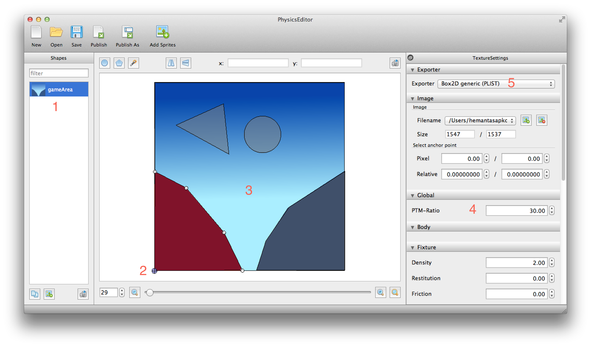

ofxPhysicsEditorBox2D
=====================

OpenFrameworks addon for loading fixtures generated by Physics Editor(https://www.codeandweb.com/physicseditor).

Features
--------
* Attach polygons and circles
* Debug draw facility of all fixtures

Dependencies
------------
* [ofxBox2d](https://github.com/vanderlin/ofxBox2d)

Output. Tested in iPad Mini Retina.
----------------------------------

The following image shows the Physics Editor file with all the fixtures.

To-Do
-----
* Support for multiple bodies
